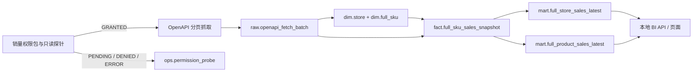

# 全托 BI 首版架构

## 目标

首版先在本地建立一条可验证、可追溯的全托管只读 BI 链路。它只消费已授权店铺的 OpenAPI 数据，不访问半托生产库，不复用半托业务表，也不在本阶段部署到云端。源码、迁移和测试由 Git 管理；数据库连接串和任何 SHEIN 凭据不进入仓库。

本架构吸收半托系统已经验证过的分层边界，但重新按全托字段和权限建模，不复制半托的大型 schema。

## 数据流

权限探针失败时，链路停止在 `ops`，不能用空数据冒充零销量。只有原始批次成功或被明确标记为部分成功，规范化器才可以写入后续层。

## 分层职责

| 层 | 作用 | 写入方式 |
| --- | --- | --- |
| `ops` | 保存逐店权限探针结果和可审计错误 | 追加；同一逻辑探针重试幂等 |
| `raw` | 保存一次逻辑 OpenAPI 请求的生命周期及脱敏响应证据 | 先建批次，再终结状态；禁止保存凭据 |
| `dim` | 保存全托店铺和 SKU 的当前稳定身份 | 按自然键 upsert |
| `fact` | 保存指定时间窗口、指定观察时点的 SKU 销量数量快照 | 追加或对同一业务粒度幂等 upsert |
| `mart` | 保存 BI 直接读取的店铺和商品最新聚合 | 在事务内全量或受控增量刷新 |

## 组件边界

1. **权限探针器**：逐店调用一个最小、只读的销量查询请求，记录 `GRANTED / PENDING / DENIED / ERROR`。应用审核通过、店铺授权完成、权限包申请成功都不能替代探针结果。
2. **抓取器**：为规范化请求生成稳定的幂等键和 SHA-256 指纹，分页读取后将脱敏证据写入 `raw`。请求头、token、cookie、签名和密钥不得持久化。
3. **规范化器**：以 `(store_id, platform_sku_id)` 归并 SKU；保留 SPU、SKC、供应商货号等身份字段，但不猜测缺失字段。
4. **事实装载器**：只写销量数量，保留测量窗口、观察时间、源批次和源行指纹。权限错误、字段缺失或窗口不明确时拒绝写事实表。
5. **Mart 刷新器**：对每个店铺和时间窗口选取每个 SKU 的最新快照，再汇总到店铺和商品。刷新与事实装载解耦，失败时旧 mart 仍可读，并通过 `refreshed_at` 显示新鲜度。
6. **本地 BI 服务**：首版只读 `mart`，必要时展示 `ops` 中的权限和抓取健康状态；不直接读取 OpenAPI，也不把缺数转换为零。

## 门户层

本地门户保持原生 HTML / CSS / JavaScript，通过 hash 路由提供总控、销量、商品、合规、备货、库存、财务、自动化运营和系统健康九个一级视图。所有视图共用同一个只读 Dashboard API 和筛选状态；业务域页面存在不等于能力已经接通。

- 总控、销量、商品和系统健康可以消费当前销量数量、权限阶段和新鲜度字段；
- 合规、备货、库存、财务和自动化运营在对应事实域接入前只展示证据边界与接入步骤；
- 趋势仅在输入数据提供真实日粒度 `salesTrend` 时渲染，否则显示空状态；
- 具体页面职责与验收标准见 `docs/portal-information-architecture.md`。

## 部署与运行阶段

当前只支持本地开发：

- PostgreSQL 使用独立本地数据库或本地容器；
- 所有数据库变更走 `db/migrations/`，按编号顺序执行；
- Git 只管理源码、迁移、测试和脱敏样例；
- 等云端磁盘扩容并完成容量、备份、权限与回滚评估后，再单独设计部署；
- 云端启用前必须重新做逐店权限探针和数据对账，不能把本地成功视为生产成功。

## 失败与恢复

- `raw.openapi_fetch_batch.status` 明确区分 `CREATED / RUNNING / SUCCEEDED / PARTIAL / FAILED`；
- 进程重启后按 `(store_id, idempotency_key)` 接续或终结批次，不重复生成事实；
- 分页只要存在缺页，批次不得标记为 `SUCCEEDED`；
- mart 更新在单事务内执行，刷新完成后才推进 `refreshed_at`；
- 任何 API 字段漂移先留在 raw 并报警，不能静默把未知字段映射为零。
