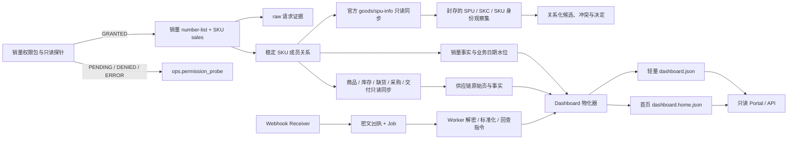

# 全托 BI 首版架构

## 目标

首版建立一条可验证、可追溯的全托管只读 BI 链路，并独立部署在 `fm.dushengyi.cc`。它只消费已授权店铺的 OpenAPI 数据，不访问半托生产库，也不复用半托业务表或凭据。源码、迁移和测试由 Git 管理；数据库连接串和任何 SHEIN 凭据不进入仓库。

本架构吸收半托系统已经验证过的分层边界，但重新按全托字段和权限建模，不复制半托的大型 schema。

## 数据流

权限探针失败时，销量链路停止在 `ops`，不能用空数据冒充零销量。供应链每个店铺、域、子类型都有独立的 `STARTED / SUCCEEDED / PARTIAL / FAILED` 追加式证据；完整空批次可以清空当前投影，部分批次永远不能把缺失对象补成零。

## 分层职责

| 层 | 作用 | 写入方式 |
| --- | --- | --- |
| `ops` | 权限探针、销量质量、商品归并候选/决定、员工分配、供应链尝试、Webhook 队列/订阅/心跳 | 审计事件追加；显式状态机只更新获准的运行表 |
| `raw` | 脱敏 OpenAPI 批次/分页证据、标识观察和 Webhook 密文回执 | 指纹幂等；冲突后精确回读；禁止凭据和个人信息 |
| `dim` | 店铺、稳定 SKU、标准商品/变体与仓库身份 | 自然键更新；SKU 活跃成员只由完整销量清单管理 |
| `fact` | 销量、库存、仓库库存、缺货、采购、交付与完整投影批次 | 业务粒度幂等；未知保持 `NULL`；当前关系由受信批次成员决定 |
| `mart` | 店铺销量、标准商品销量及 BI 读取投影 | 只读物化器在事务内刷新，再原子发布 JSON |

## 组件边界

1. **权限探针器**：逐店调用一个最小、只读的销量查询请求，记录 `GRANTED / PENDING / DENIED / ERROR`。应用审核通过、店铺授权完成、权限包申请成功都不能替代探针结果。
2. **销量同步器**：完成稳定清单、每批 100 个 SKU 的销量抓取、日期锚定、合法零销量识别、不可变 raw/run/probe 回读和业务水位推进。非零无日期行始终隔离；同批存在统一业务日时只发布有日期行并标记 `PARTIAL`，完全没有可锚定行时整店质量阻断。隔离事件保存有界 SKU code 以支持定位，不给缺失日期补值。
3. **供应链同步器**：商品接口只补充属性；库存请求集合来自最新可接受销量清单。全托生产必需库存域为 SHEIN 仓实物库存 PI 与商家 JIT 库存 JI；VI 是商家虚拟库存，仅保留显式诊断能力，不作为全托覆盖门槛。库存请求在官方过渡期同时发送 `invType` 与相容的 `warehouseType`（PI=1，VI/JI=3），且以 `invType` 作为新口径。产品、库存、缺货建议、采购和交付分别记录同步尝试，失败域不污染其他域。商品身份事实使用官方新版 `/open-api/goods/spu-info`；旧 `product/full-detail` 投影不能作为冻结的归并证据。
4. **商品身份层**：店内以平台 SKU 为强键。新版详情按 SPU、SKC、SKU 分层封存 seller code、官方商品属性、销售属性和多值 EAN/UPC；`productAttributeInfoList` 必须先扣除 SKC/SKU 销售属性。供应商货号、商家 SKU、标题和图片 URL 都只是候选信号。自动跨店归并只接受校验通过的 GTIN、官方“产品型号”属性、品牌与末级分类，以及类别白名单规格组成的多源证据；电压、插头、容量、分类或关键尺寸冲突一律阻断。
5. **Webhook 接收与 Worker**：公网接收器只验签、限流并持久化密文；Worker 才能解密和标准化。Worker 只生成“需要只读回查”的指令，不持有实际回查客户端。空队列不能证明进程健康，Receiver 和 Worker 都必须有新鲜心跳。
6. **Dashboard 物化器**：使用独立只读数据库角色，读取销量、供应链、商品身份、权限与运行健康。轻量核心写入 `dashboard.json`，首页历史写入 `dashboard.home.json`；两个 staging 文件都成功后先提升首页分片、最后提升核心文件，避免 Portal 观察到半套新版本。
7. **BI 服务**：只读 JSON，不持有数据库或平台凭据，不把缺数转换为零。核心文件按文件版本缓存在内存，首页使用带日期、负责人/店铺和关键词参数的 `/api/home` 按需读取，只返回当前区间、等长对比区间及金额/销量 Top 货号并集；大响应协商 gzip。认证用户可通过 `refresh=1` 丢弃 Portal 进程内解析缓存并重新读取已物化文件；该操作不触发 SHEIN 抓取、数据库物化或平台写入。所有员工读取同一份全店数据；负责人/店铺仅作筛选，不限制看数范围。
8. **写权限骨架**：未来写入必须同时满足全局开关、仓库授权身份、角色、能力和本人 `PRIMARY / SUPPORT` 店铺分配。员工可以看全部店，但不能把写权限带到别人负责的店。当前 HTTP mutation 与 SHEIN 写操作均拒绝。

## 门户层

门户保持原生 HTML / CSS / JavaScript，通过 hash 路由提供总控、销量、
商品、库存供给、采购单、交付入仓、平台动态、自动化运营和系统健康
视图。总览先消费轻量 Dashboard 核心，再按当前筛选消费独立首页 API；
采购单使用独立的服务端筛选与分页 API。它们只读取物化后的 JSON，Portal 不获得数据库
或平台凭据。认证后的 SSE 只广播 Dashboard 原子提升通知，浏览器据此
重取快照，不把文件更新冒充 SHEIN 实时事实。

- 总控展示四个销量窗口、真实逐日趋势、店铺与标准商品排行、业务日期、覆盖和质量；
- 总控在上述事实之上形成只读“经营脉搏”，只推导可证明的近 7 日/此前 23 日日均动量、供给关注、优先下钻对象和覆盖阻断；
- `/api/sales` 与 `/api/procurement` 都在认证后读取同一严格白名单快照并执行服务端筛选、稳定排序和有界分页；响应携带物化 `returned / total / truncated`，Portal 仍无数据库与 SHEIN 凭据；
- 商品页展示标准商品、店内身份与待归并货号，绝不跨店合并裸 SKU；
- 采购、交付、库存和缺货页消费独立只读事实，字段覆盖不足时显示未知；
- 平台页区分 Receiver / Worker 心跳、队列、订阅回读和规范化事件；
- 合规、采购退货、财务和自动化只展示已有证据与未接入边界；
- 具体页面职责与验收标准见 `docs/portal-information-architecture.md`。

## 部署与运行阶段

本地开发与云端生产使用同一代码契约：

- 云端为 Portal、物化器、销量、供应链、Webhook 接收和 Worker 建立独立 Unix 用户与数据库角色；
- 所有数据库变更走 `db/migrations/`，按编号顺序执行；
- Git 只管理源码、迁移、测试、脱敏样例和无密钥部署配置；
- 生产凭据只存放在 `/srv/shein-fm/secrets`，运行数据和备份只存放在 `/srv/shein-fm`；
- 发布采用不可变 release 目录和 `current` 软链接，回滚只切换到上一个已验证 release；
- 逐店权限探针和数据对账必须在云端执行，不能把本地测试视为生产成功。

## 失败与恢复

- 只在完整请求通过字段和分页校验后写入受信批次；失败证据进入权限或同步尝试账本；
- 同一显式 `run_id` 重试时按 `(store_id, idempotency_key)` 与请求指纹拒绝漂移并保证事实幂等，但不提供中途断点续传；
- 分页只要存在缺页，就不写 raw 成功批次或事实；
- Dashboard 更新先写私有 staging 文件，物化成功后才原子替换 Portal 当前文件；
- 任何 API 字段漂移先留在 raw 并报警，不能静默把未知字段映射为零。
