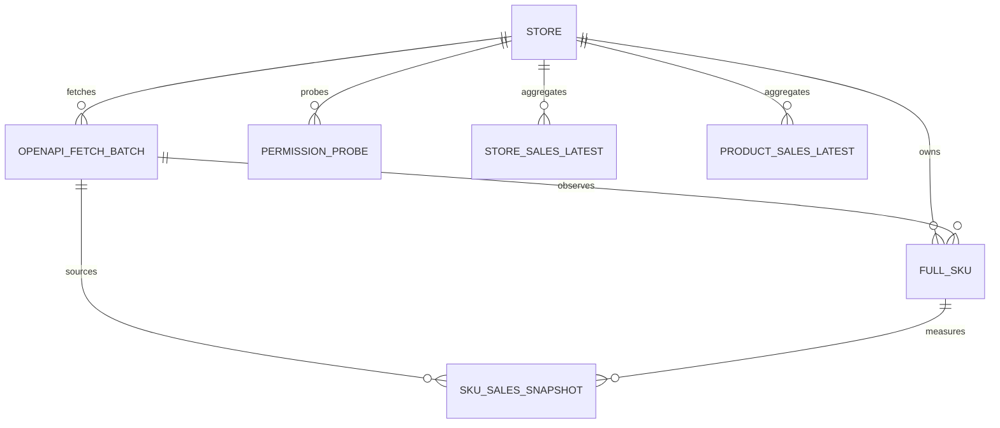

# 全托 BI 首版数据模型

## 统一约定

- 所有业务时间使用 PostgreSQL `timestamptz`；写入时保留来源时间语义，读取时再按店铺时区展示。
- 测量窗口采用半开区间 `[metric_window_start, metric_window_end)`。
- `snapshot_at` 是来源数据的观察时点，`created_at / updated_at` 是仓库写入时间，二者不能混用。
- `ops.touch_updated_at()` 统一维护所有可变表的 `updated_at`。
- SHA-256 指纹使用 64 位小写十六进制字符串。
- 所有原始 JSON 和探针证据必须先脱敏；禁止落库 token、cookie、签名、密钥和请求头。

## 表与粒度

### `dim.store`

粒度：每个全托管店铺一行。

- 主键：`store_id`
- 自然唯一键：`store_code`
- 条件唯一键：非空 `platform_shop_id`
- `cooperation_mode` 固定为 `FULL_MANAGED`，防止半托身份混入
- `first_seen_at / last_seen_at` 表示身份可见区间

### `raw.openapi_fetch_batch`

粒度：一个店铺的一次逻辑 OpenAPI 请求批次一行。分页范围属于幂等键的一部分；同一批次可以从 `CREATED` 更新到终态，但不得另建重复批次。

- 主键：`fetch_batch_id`
- 唯一键：`(store_id, idempotency_key)`
- `request_fingerprint`：规范化请求体的 SHA-256，不含凭据或随请求变化的签名
- `metric_window_*`：本次销量请求覆盖的测量窗口
- `response_payload`：脱敏原始响应证据，可为空
- `status`：`CREATED / RUNNING / SUCCEEDED / PARTIAL / FAILED`

建议幂等键输入：`store_code + endpoint_code + normalized_window + normalized_filters + page_scope + api_version`。

### `dim.full_sku`

粒度：一个全托店铺的一个平台 SKU 一行。

- 主键：`full_sku_id`
- 唯一键：`(store_id, platform_sku_id)`
- 复合唯一键：`(store_id, full_sku_id)`，供事实表强制校验店铺与 SKU 归属一致
- `product_key` 为生成列，聚合优先级是 `SPU → SKC → SKU`
- `source_fetch_batch_id` 指向最近一次确认该身份的原始批次

`product_key` 只是首版聚合键，不是跨店统一商品主数据。后续如需跨店 canonical product，必须另建映射和对账规则。

### `fact.full_sku_sales_snapshot`

粒度：一个店铺、一个 SKU、一个测量窗口、一个观察时点一行。

- 主键：`sales_snapshot_id`
- 源幂等唯一键：`(source_fetch_batch_id, source_row_key)`
- 业务幂等唯一键：`(store_id, full_sku_id, metric_window_start, metric_window_end, snapshot_at)`
- `sales_quantity`：来源接口返回的非负销量数量
- `payload_fingerprint`：用于发现同一业务粒度的源数据漂移
- 复合外键确保 `store_id` 与 `full_sku_id` 属于同一店铺

此表不含金额、币种、订单数、订单明细、成本、利润或毛利字段。销量数量不能乘当前价格推导历史销售额。

### `mart.full_store_sales_latest`

粒度：一个店铺、一个测量窗口一行，仅保留该窗口最新可用聚合。

- 主键：`(store_id, metric_window_start, metric_window_end)`
- 度量：`sales_quantity / sku_count / product_count / source_fact_count`
- 新鲜度：`latest_snapshot_at / source_max_fact_updated_at / refreshed_at`

生成规则：先在同一店铺和窗口内为每个 SKU 选择最大的 `snapshot_at`，再求和。不同窗口不得直接相加，因为窗口可能重叠。

### `mart.full_product_sales_latest`

粒度：一个店铺、一个 `product_key`、一个测量窗口一行。

- 主键：`(store_id, product_key, metric_window_start, metric_window_end)`
- 度量：`sales_quantity / sku_count / source_fact_count`
- SPU、SKC 和商品名是展示属性，不参与主键

生成规则与店铺 mart 相同，先选 SKU 最新快照，再按 `product_key` 聚合。

### `ops.permission_probe`

粒度：一个店铺的一次逻辑权限探针一行。

- 主键：`permission_probe_id`
- 唯一键：`(store_id, idempotency_key)`
- `outcome`：`GRANTED / PENDING / DENIED / ERROR`
- `evidence`：脱敏后的最小响应元数据

当前有效权限状态由 `(store_id, capability_code)` 下 `probed_at` 最新一行决定；不要覆盖历史结果，也不要把 HTTP 200 单独判定为授权成功。

## 关系

## Upsert 与幂等规则

| 对象 | 冲突目标 | 处理 |
| --- | --- | --- |
| 店铺 | `store_code` | 更新名称、主体、平台 ID、活跃态和 `last_seen_at` |
| 抓取批次 | `store_id + idempotency_key` | 接续原批次；终态批次默认不回退到运行态 |
| SKU | `store_id + platform_sku_id` | 更新当前属性和 `last_seen_at`，不改变主键 |
| 销量事实 | 源唯一键或业务唯一键 | 内容相同则 no-op；指纹不同则告警后受控更正，禁止静默累加 |
| Mart | 自然复合主键 | 以一次事务的最新事实聚合覆盖，并推进新鲜度字段 |
| 权限探针 | `store_id + idempotency_key` | 同一探针重试 no-op；新的探针时间生成新键并保留历史 |

数据库约束负责阻止重复，应用层仍须记录受影响行数并核对期望值。迁移文件本身可重复执行用于首次安装恢复；已经部署后的结构升级必须新增迁移文件。
