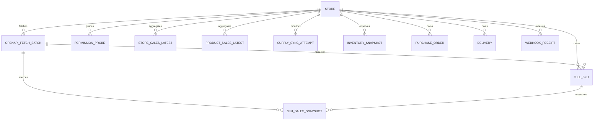

# 全托 BI 首版数据模型

## 统一约定

- 所有业务时间使用 PostgreSQL `timestamptz`；写入时保留来源时间语义，读取时再按店铺时区展示。
- 测量窗口采用半开区间 `[metric_window_start, metric_window_end)`。
- `snapshot_at` 是来源数据的观察时点，`created_at / updated_at` 是仓库写入时间，二者不能混用。
- `ops.touch_updated_at()` 统一维护所有可变表的 `updated_at`。
- SHA-256 指纹使用 64 位小写十六进制字符串。
- 所有原始 JSON 和探针证据必须先脱敏；禁止落库 token、cookie、签名、密钥和请求头。
- 未知数量使用 `NULL`，不能为了图表或汇总方便转成零。
- 追加式证据表发生幂等冲突时必须精确回读指纹；同键不同内容立即失败。

## 表与粒度

### `dim.store`

粒度：每个全托管店铺一行。

- 主键：`store_id`
- 自然唯一键：`store_code`
- 条件唯一键：非空 `platform_shop_id`
- `cooperation_mode` 固定为 `FULL_MANAGED`，防止半托身份混入
- `first_seen_at / last_seen_at` 表示身份可见区间

### `raw.openapi_fetch_batch`

粒度：一个店铺的一次逻辑 OpenAPI 请求批次一行。分页范围属于幂等键的一部分。当前销量与供应链 loader 只在完整校验后写终态，并把它作为不可变证据；旧 schema 保留的运行态不能被新 loader 用来静默改写终态。

- 主键：`fetch_batch_id`
- 唯一键：`(store_id, idempotency_key)`
- `request_fingerprint`：规范化请求体的 SHA-256，不含凭据或随请求变化的签名
- `metric_window_*`：本次销量请求覆盖的测量窗口
- `response_payload`：脱敏原始响应证据，可为空
- `status`：`CREATED / RUNNING / SUCCEEDED / PARTIAL / FAILED`

建议幂等键输入：`store_code + endpoint_code + normalized_window + normalized_filters + page_scope + api_version`。

### `dim.full_sku`

粒度：一个全托店铺的一个平台 SKU 一行。

- 主键：`full_sku_id`
- 唯一键：`(store_id, platform_sku_id)`
- 复合唯一键：`(store_id, full_sku_id)`，供事实表强制校验店铺与 SKU 归属一致
- `product_key` 为生成列，聚合优先级是 `SPU → SKC → SKU`
- `source_fetch_batch_id` 指向最近一次确认该身份的原始批次
- `is_active / catalog_run_key / retired_at` 表示最新完整稳定 `number-list` 的成员关系

稳定成员关系只由销量 `number-list` 管理。商品目录与详情可以补充属性，但不能激活或复活 SKU。

### `fact.full_sku_sales_snapshot`

粒度：一个店铺、一个 SKU、一个测量窗口、一个观察时点一行。

- 主键：`sales_snapshot_id`
- 源幂等唯一键：`(source_fetch_batch_id, source_row_key)`
- 业务幂等唯一键：`(store_id, full_sku_id, metric_window_start, metric_window_end, snapshot_at)`
- `sales_quantity`：来源接口返回的非负销量数量
- `payload_fingerprint`：用于发现同一业务粒度的源数据漂移
- 复合外键确保 `store_id` 与 `full_sku_id` 属于同一店铺

此表不含金额、币种、订单数、订单明细、成本、利润或毛利字段。销量数量不能乘当前价格推导历史销售额。

### `mart.full_store_sales_latest`

粒度：一个店铺、一个测量窗口一行，仅保留该窗口最新可用聚合。

- 主键：`(store_id, metric_window_start, metric_window_end)`
- 度量：`sales_quantity / sku_count / product_count / source_fact_count`
- 新鲜度：`latest_snapshot_at / source_max_fact_updated_at / refreshed_at`

生成规则：先在同一店铺和窗口内为每个 SKU 选择最大的 `snapshot_at`，再求和。不同窗口不得直接相加，因为窗口可能重叠。

### `mart.full_product_sales_latest`

粒度：一个店铺、一个 `product_key`、一个测量窗口一行。

- 主键：`(store_id, product_key, metric_window_start, metric_window_end)`
- 度量：`sales_quantity / sku_count / source_fact_count`
- SPU、SKC 和商品名是展示属性，不参与主键

生成规则与店铺 mart 相同，先选 SKU 最新快照，再按 `product_key` 聚合。

### `ops.permission_probe`

粒度：一个店铺的一次逻辑权限探针一行。

- 主键：`permission_probe_id`
- 唯一键：`(store_id, idempotency_key)`
- `outcome`：`GRANTED / PENDING / DENIED / ERROR`
- `evidence`：脱敏后的最小响应元数据

当前有效权限状态由 `(store_id, capability_code)` 下 `probed_at` 最新一行决定；不要覆盖历史结果，也不要把 HTTP 200 单独判定为授权成功。

### 销量可信层

- `ops.sales_sync_run`：一店一次销量同步结果，分别记录运行状态、业务日期锚定、质量状态、SKU 覆盖和四个销量窗口；
- `ops.sales_quality_event`：具体质量原因、影响 SKU 数和最多 100 个受影响 SKU code；合法零销量使用信息级事件，非零隔离使用告警或错误事件；
- `ops.sales_business_watermark`：每店最新已接受业务日期，质量阻断运行不能推进；
- `LEGAL_ZERO_UNANCHORED` 表示完整零响应无 `dt`，是合法零而不是错误；非零无日期必须隔离。有统一业务日的其他行仍可按 `PARTIAL` 入仓并推进部分水位；完全没有可锚定行时才整店 `QUALITY_BLOCKED`。

### 标准商品与员工分配

- `raw.product_identity_observation_set`：一次官方 `goods/spu-info` 回读中、一个店铺 SKU 的冻结观察集；先写 `BUILDING` 成员，校验数量与指纹后一次封存为 `SEALED`；
- `raw.identifier_observation`：观察集内按 `PRODUCT / VARIANT` 分层的原始标识成员；EAN/UPC 一码一行并固定在变体层，原值永不被归一化值覆盖；
- `dim.canonical_product / dim.canonical_variant`：带冻结来源的标准商品与变体；店内 singleton 与跨店 global 身份必须显式区分，不能把前者伪装成已完成跨店归并；
- `ops.product_match_candidate / ops.product_identity_decision`：候选、冲突和人工决定；
- `dim.full_sku_canonical_assignment`：店内 SKU 到标准变体的当前映射；
- `ops.employee_principal / ops.employee_store_assignment`：员工身份与 `PRIMARY / SUPPORT / VIEW_ONLY` 店铺分配。

裸 SKU、平台 SPU/SKC、标题、图片 URL、供应商货号或商家 SKU 相同都不能单独跨店归并。官方型号必须来自属性 ID `1000546`；条码必须通过 GTIN-8/12/13/14 校验位；通用属性只有进入类别白名单后才能参加自动门禁。登录员工读取全店数据；店铺分配只作为负责人筛选和未来写权限依据。

### 供应链事实

- `raw.openapi_fetch_page`：分页级脱敏响应证据；
- `ops.supply_sync_attempt`：店铺 × 域 × 子类型 × 模式的追加式 `STARTED / SUCCEEDED / PARTIAL / FAILED` 账本；
- `fact.supply_projection_batch / fact.supply_projection_member`：库存和缺货建议的可信当前批次成员关系；完整空批次可以清空当前投影，部分批次不能替代上一完整投影；
- `dim.full_warehouse`：全托仓库身份；
- `fact.inventory_snapshot / fact.warehouse_inventory_snapshot`：PI / JI 全托生产库存总量与仓库明细；模型兼容保留 VI，但不把无商家虚拟库存的全托店判为缺数；
- `fact.stock_advice_snapshot / fact.shortage_event`：缺货建议与缺货观察；
- `dim.reporting_goods / dim.full_sku_reporting_goods_assignment`：人工确认的首页经营报表货号与逐 SKU 时间映射；独立于严格 canonical identity，不写回 SHEIN；
- `ops.reporting_goods_import_run`：报表货号 manifest、批准口径、数量和应用/回滚状态审计；
- `fact.purchase_order / fact.purchase_order_line / fact.purchase_order_jit_relation`：采购单、行和 JIT 关系；
- `fact.delivery / fact.delivery_line`：交付单、行和里程碑；
- `ops.reconciliation_result`：数量与关系对账。

库存请求集合来自最新可接受销量清单。最新销量运行失败、成员数量漂移或无证据时必须关闭库存同步，不能改用商品目录清单。

### Webhook

- `raw.webhook_receipt`：验签后密文、指纹和重复计数；
- `ops.webhook_job`：异步解密/标准化租约、重试和死信；
- `ops.operational_event`：脱敏标准化事件；
- `ops.webhook_hydration_directive`：需要后续只读回查的指令及其 `PENDING / RUNNING / RETRY / SUCCEEDED / FAILED`、租约、重试与脱敏错误状态；只有精确 OpenAPI 行入仓验真后才标记成功；
- `ops.webhook_subscription_state / ops.webhook_store_gate`：订阅回读与店铺授权门禁；
- `ops.webhook_runtime_heartbeat`：Receiver 与 Worker 的追加式运行心跳。

Webhook 使用 10 分钟签名投递窗口的至少一次语义。同窗口同密文重试合并，跨窗口同载荷形成新事件；窗口边界可能重复，因此所有下游写入必须幂等。

## 关系

## Upsert 与幂等规则

| 对象 | 冲突目标 | 处理 |
| --- | --- | --- |
| 店铺 | `store_code` | 更新名称、主体、平台 ID、活跃态和 `last_seen_at` |
| 抓取批次 | `store_id + idempotency_key` | 内容相同 no-op；请求、响应、时间或记录数漂移则失败 |
| SKU | `store_id + platform_sku_id` | 更新当前属性和 `last_seen_at`，不改变主键 |
| 销量事实 | 源唯一键或业务唯一键 | 内容相同 no-op；指纹不同直接失败，禁止静默累加 |
| Mart | 自然复合主键 | 以一次事务的最新事实聚合覆盖，并推进新鲜度字段 |
| 权限探针 | `store_id + idempotency_key` | 同一探针精确重放 no-op；任一证据漂移失败 |
| 供应链尝试 | 店铺、域、子类型、attempt、status | STARTED 与一个终态分别追加；LIVE 与 BACKFILL 隔离 |
| 投影批次 | 店铺、域、子类型、观察时间 | 成员集合顺序无关；同观察时点内容漂移失败 |
| Webhook 回执 | 有界 occurrence idempotency key | 同窗口重试增加重复计数；跨窗口形成新回执 |

数据库约束负责阻止重复，应用层仍须记录受影响行数并核对期望值。迁移文件本身可重复执行用于首次安装恢复；已经部署后的结构升级必须新增迁移文件。
